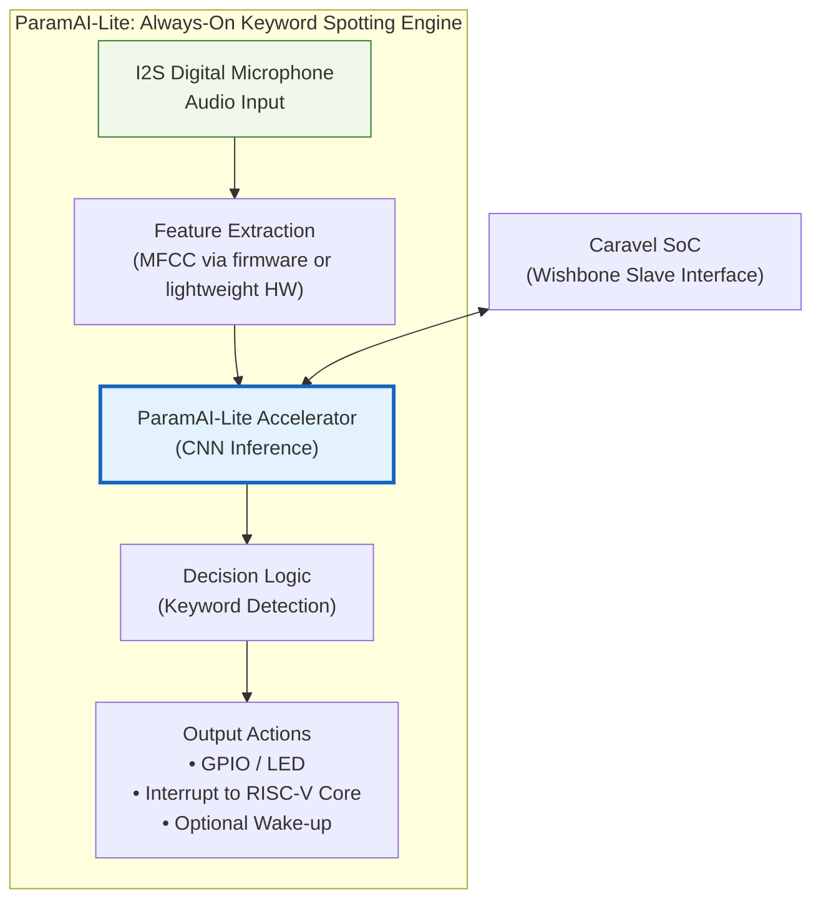

# ParamAI-Lite: Low-Power Edge AI Accelerator System
### ChipFoundry Silicon Application Challenge Submission (SKY130)

**ParamAI-Lite** is a low-power edge AI accelerator designed as a complete embedded application for the Caravel SoC. It is specifically optimized for **Always-On Keyword Spotting (KWS)** workloads.

## Project Overview
* **Application:** Keyword Spotting Engine for audio processing.
* **Core Tech:** 8x8 MAC Array (64 units/cycle) with INT8 precision.
* **Performance:** ~3.2 GMAC/s throughput at 50 MHz, consuming < 10 mW.
* **Interface:** Wishbone Slave for seamless Caravel integration.

## Proposal Summary
ParamAI-Lite proposes a low-power always-on keyword spotting engine integrated into the Caravel SoC. The design leverages a compact 8×8 MAC-based CNN accelerator with INT8 precision to achieve sub-10 mW operation, enabling edge AI inference for voice-triggered applications.

## Architecture Summary
The system features a weight-stationary dataflow pipeline including a preprocessing engine, partial sum accumulator, activation (ReLU), and pooling units. To ensure physical design success on SKY130, memory is partitioned into smaller OpenRAM macros to reduce routing congestion.

## System Architecture
### Top-Level System Block Diagram (KWS Engine)



## Roadmap & Development Plan
This project follows a 5-week execution timeline to meet the final design submission deadline of April 30th.

| Week | Focus | Deliverable |
| :--- | :--- | :--- |
| **Week 1** | Infrastructure | Wishbone interface, configuration registers, and PCB schematic. |
| **Week 2** | Control Logic | Two-process FSM design, input/output buffers, and initial floorplan. |
| **Week 3** | Compute Core | 8x8 MAC array implementation and RTL synthesis for SKY130. |
| **Week 4** | Neural Ops | Activation (ReLU), pooling units, and RISC-V management firmware. |
| **Week 5** | Integration | Full system assembly, Gate-Level Simulation (GLS), and final demo. |

---

## AI-Assisted Design Workflow
This project utilizes generative AI to accelerate RTL development. All prompt logs, raw outputs, and final edited RTL documentation are maintained in the `docs/ai_prompts/` directory to ensure transparency and reproducibility.

## Documentation & Resources
For detailed hardware specifications and register maps, refer to the following official documents:

* **[Caravel Datasheet](https://github.com/chipfoundry/caravel/blob/main/docs/caravel_datasheet_2.pdf)**: Detailed electrical and physical specifications of the Caravel harness.
* **[Caravel Technical Reference Manual (TRM)](https://github.com/chipfoundry/caravel/blob/main/docs/caravel_datasheet_2_register_TRM_r2.pdf)**: Complete register maps and programming guides for the management SoC.
* **[ChipFoundry Marketplace](https://platform.chipfoundry.io/marketplace)**: Access additional IP blocks, EDA tools, and shuttle services.

---

## Prerequisites
Ensure your environment meets the following requirements:

1. **Docker** [Linux](https://docs.docker.com/desktop/setup/install/linux/ubuntu/) | [Windows](https://docs.docker.com/desktop/setup/install/windows-install/) | [Mac](https://docs.docker.com/desktop/setup/install/mac-install/)
2. **Python 3.8+** with `pip`.
3. **Git**: For repository management.

---

## Project Structure
A successful Caravel project requires a specific directory layout for the automated tools to function:

| Directory | Description |
| :--- | :--- |
| `openlane/` | Configuration files for hardening macros and the wrapper. |
| `verilog/rtl/` | Source Verilog code for the project. |
| `verilog/gl/` | Gate-level netlists (generated after hardening). |
| `verilog/dv/` | Design Verification (cocotb and Verilog testbenches). |
| `gds/` | Final GDSII binary files for fabrication. |
| `lef/` | Library Exchange Format files for the macros. |

---

## Starting Your Project

### 1. Repository Setup
Create a new repository based on the `caravel_user_project` template and clone it to your local machine:

```bash
git clone <your-github-repo-URL>
pip install chipfoundry-cli
cd <project_name>
```

### 2. Project Initialization

> [!IMPORTANT]
> Run this first! Initialize your project configuration:

```bash
cf init
```

This creates `.cf/project.json` with project metadata. **This must be run before any other commands** (`cf setup`, `cf gpio-config`, `cf harden`, `cf precheck`, `cf verify`).

### 3. Environment Setup
Install the ChipFoundry CLI tool and set up the local environment (PDKs, OpenLane, and Caravel lite):

```bash
cf setup
```

The `cf setup` command installs:

- Caravel Lite: The Caravel SoC template.
- Management Core: RISC-V management area required for simulation.
- OpenLane: The RTL-to-GDS hardening flow.
- PDK: Skywater 130nm process design kit.
- Timing Scripts: For Static Timing Analysis (STA).

---

## Development Flow

### Hardening the Design
Hardening is the process of synthesizing your RTL and performing Place & Route (P&R) to create a GDSII layout.

#### Macro Hardening
Create a subdirectory for each custom macro under `openlane/` containing your `config.tcl`.

```bash
cf harden --list         # List detected configurations
cf harden <macro_name>   # Harden a specific macro
```

#### Integration
Instantiate your module(s) in `verilog/rtl/user_project_wrapper.v`.

Update `openlane/user_project_wrapper/config.json` environment variables (`VERILOG_FILES_BLACKBOX`, `EXTRA_LEFS`, `EXTRA_GDS_FILES`) to point to your new macros.

#### Wrapper Hardening
Finalize the top-level user project:

```bash
cf harden user_project_wrapper
```

### Verification

#### 1. Simulation
We use cocotb for functional verification. Ensure your file lists are updated in `verilog/includes/`.

**Configure GPIO settings first (required before verification):**

```bash
cf gpio-config
```

This interactive command will:
- Configure all GPIO pins interactively
- Automatically update `verilog/rtl/user_defines.v`
- Automatically run `gen_gpio_defaults.py` to generate GPIO defaults for simulation

GPIO configuration is required before running any verification tests.

Run RTL Simulation:

```bash
cf verify <test_name>
```

Run Gate-Level (GL) Simulation:

```bash
cf verify <test_name> --sim gl
```

Run all tests:

```bash
cf verify --all
```

#### 2. Static Timing Analysis (STA)
Verify that your design meets timing constraints using OpenSTA:

```bash
make extract-parasitics
make create-spef-mapping
make caravel-sta
```

> [!NOTE]
> Run `make setup-timing-scripts` if you need to update the STA environment.

---

## GPIO Configuration
Configure the power-on default configuration for each GPIO using the interactive CLI tool.

**Use the GPIO configuration command:**
```bash
cf gpio-config
```

This command will:
- Present an interactive form for configuring GPIO pins 5-37 (GPIO 0-4 are fixed system pins)
- Show available GPIO modes with descriptions
- Allow selection by number, partial key, or full mode name
- Save configuration to `.cf/project.json` (as hex values)
- Automatically update `verilog/rtl/user_defines.v` with the new configuration
- Automatically run `gen_gpio_defaults.py` to generate GPIO defaults for simulation (if Caravel is installed)

**GPIO Pin Information:**
- GPIO[0] to GPIO[4]: Preset system pins (do not change).
- GPIO[5] to GPIO[37]: User-configurable pins.

**Available GPIO Modes:**
- Management modes: `mgmt_input_nopull`, `mgmt_input_pulldown`, `mgmt_input_pullup`, `mgmt_output`, `mgmt_bidirectional`, `mgmt_analog`
- User modes: `user_input_nopull`, `user_input_pulldown`, `user_input_pullup`, `user_output`, `user_bidirectional`, `user_output_monitored`, `user_analog`

> [!NOTE]
> GPIO configuration is required before running `cf precheck` or `cf verify`. Invalid modes cannot be saved - all GPIOs must have valid configurations.

---

## Local Precheck
Before submitting your design for fabrication, run the local precheck to ensure it complies with all shuttle requirements:

> [!IMPORTANT]
> GPIO configuration is required before running precheck. Make sure you've run `cf gpio-config` first.

```bash
cf precheck
```

You can also run specific checks or disable LVS:

```bash
cf precheck --disable-lvs                    # Skip LVS check
cf precheck --checks license --checks makefile  # Run specific checks only
```
---

## Checklist for Shuttle Submission
- [ ] Top-level macro is named user_project_wrapper.
- [ ] Full Chip Simulation passes for both RTL and GL.
- [ ] Hardened Macros are LVS and DRC clean.
- [ ] user_project_wrapper matches the required pin order/template.
- [ ] Design passes the local cf precheck.
- [X] Documentation (this README) is updated with project-specific details.
